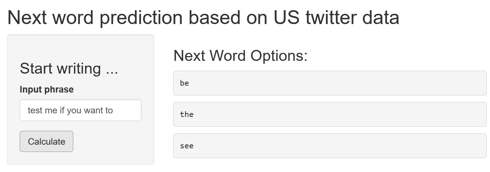

```{r setup, include=FALSE}
knitr::opts_chunk$set(echo = FALSE)
```

## The task at hand was to build a simple app for a next-word-algorithm

This slide deck briefly describes a web app, which mimics a key feature of the [Swiftkey Keyboard App](https://en.wikipedia.org/wiki/Microsoft_SwiftKey). This key feature predicts a likely **next word** when given an input phrase from the user. This is accomplished by analyzing (i.e. learning from) a given text corpus leveraging **ngrams** and their respective frequency in the corpus.

This app has been developed to fulfill the expectations of the **Cap Stone Project** (course #10 of Coursera's Data Science Specialization). The training data used is originally from **Twitter** (language: U.S. English) and can be downloaded from [a Coursera repository](https://d396qusza40orc.cloudfront.net/dsscapstone/dataset/Coursera-SwiftKey.zip)

Technically, the app uses **R** for building and training the model, **shinyapps.io** for publishing the app and **RPubs** for publication of these pitch slides.

The app can be viewed at [Swiftkey_minime](https://nagrne-boris-blazej.shinyapps.io/Swiftkey_minime/), the pitch presentation at [Swiftkey_minime_pitch](https://rpubs.com/borisblazej/swiftkey_minime_pitch).

------------------------------------------------------------------------

## There are relevant limitations to consider when using the app

**Natural language processing** in general and the task at hand are resource intensive both in terms of processing power and memory usage. Hence, to make the algorithm usable at a free webapp provider, ...

... the **input text** has been limited to 300.000 text rows 

... the **learning capacity** has been limited to only the top 1.500 ngrams 

... the algorithm uses single words, bigrams, trigrams and **tetragrams** (4-word-phrases) only

All these parameters could be changed in principle to higher values, which should improve performance but make the app slower (both, during the learning and the prediction phase!) and the data set in memory larger.

With above mentioned parameters the "performance" of predicting the **right word** is only at **\~10%**. With optimization and higher parameters this can be tweaked to \~20%. Hence, the value of the app is less "prediction", but rather offering **frequent or popular next words**.

------------------------------------------------------------------------

## The front end of the app is simple and functional

Usage is simple: the user provides an input phrase and by clicking the "calculate" button is provided with the the 3 most likely next words to the right.


[{width="600"}](https://nagrne-boris-blazej.shinyapps.io/Swiftkey_minime/)


---

## The algorithm identifies most frequent next words matching the final input words

The complete logic of the algorithms is implemented in the file "R/swiftkey1.R" which can be viewed on [Github](https://github.com/borisblazej/coursera-capstone-swiftkey).

Heart piece is the function _prediction_list(model, words)_ which takes a ngram frequency table ("model") and a vector of __max. 3 (final) words__ of the input phrase. The function __reduces the full frequency table step wise__ to the most frequent ones using the 3, 2 and 1 final words. Any matches that use all 3 words is then weighted higher than matches with only 2 words and those higher than matches with only 1 word. If no word matches, the algorithm falls back to the __most frequent single words__ in the training data (e.g. "the", "to", "i")

Theoretically, the algorithm could take any input text and perform a training process according to the parameters discussed above. To keep loading time of the app short the training process has been performed upfront deployment and the model is provided on the fly as ready-made input data (size: 37 kB).

---